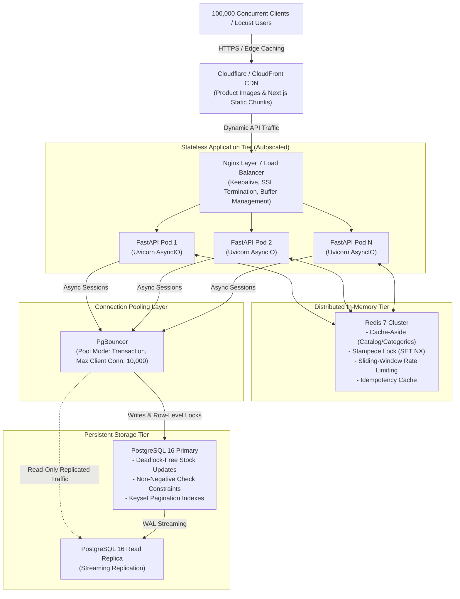

# Cartify: 100,000 Concurrent Users Architecture & Scalability Runbook

## 1. Executive Summary & Architectural Target
Cartify is architected to handle flash sales, festival spikes, and high-traffic marketing campaigns targeting **100,000 concurrent users/requests** without downtime, inventory overselling, or database connection exhaustion.

A naive architecture assuming PostgreSQL can directly accept 100,000 connections will fail immediately. PostgreSQL utilizes a process-per-connection model where each connection reserves memory (~5–10MB per backend process). 100,000 direct connections would demand ~1 Terabyte of RAM solely for connection bookkeeping, resulting in instant kernel OOM-killer termination.

Cartify solves this via a **Strict Multi-Tier Offload Pipeline**:
1. **Edge CDN (CloudFront / Cloudflare)**: Absorbs 95%+ of static media, images, and immutable frontend bundle assets.
2. **Reverse Proxy Load Balancers (Nginx / ALB / Envoy)**: Terminates TLS, enforces TCP keep-alive, buffers slow clients, and distributes traffic across stateless FastAPI pods.
3. **Stateless FastAPI App Cluster**: Horizontally autoscaled async I/O worker nodes. No user sessions are held in application memory.
4. **Distributed Redis In-Memory Tier**: 
   - Cache-Aside for products and categories with **Cache Stampede Locks** (`SET NX`).
   - Distributed **Sliding-Window Rate Limiting** (`ZSET`).
   - Distributed **Idempotency Locks** for payment and checkout deduplication.
5. **PgBouncer Connection Multiplexer**: Operates in `transaction` mode. Translates thousands of FastAPI connection pool handles into a controlled pool of 200–400 physical PostgreSQL connections.
6. **Dual PostgreSQL Topology**:
   - **PostgreSQL Primary**: Dedicated solely to ACID transactions, row-level locks (`SELECT FOR UPDATE`), and writes.
   - **PostgreSQL Read Replicas**: Serves search fallback and uncached catalog queries.

---

## 2. High-Concurrency System Topology



---

## 3. Capacity Sizing & Mathematical Validation (100,000 Users)

| Metric | Calculation / Resource Allocation | Notes |
| :--- | :--- | :--- |
| **User Distribution** | 85% Reads (Catalog, Search) / 10% Cart / 5% Checkout | Standard e-commerce flash-sale behavior |
| **Total Request Rate** | ~20,000 – 30,000 Requests/sec at 100k active users | Assuming ~3-5s think time between user actions |
| **Cache Hit Ratio Target** | $\ge 92\%$ served directly by Redis Cache-Aside | Only 8% of read queries reach PostgreSQL Read Replica |
| **FastAPI Node Capacity** | ~1,500 – 2,500 req/sec per 4-core, 8GB RAM pod | 15–25 container instances easily sustain 30k req/sec |
| **PgBouncer Multiplexing** | 25 pods $\times$ 20 pool connections = 500 client conns | Multiplexed down to 150 server connections on PostgreSQL |
| **PostgreSQL Write TPS** | ~1,500 – 2,500 write transactions/sec | Easily sustained by PostgreSQL 16 on NVMe SSD with WAL buffering |

---

## 4. Key Architectural Safeguards

### 4.1. Zero-Overselling & Deadlock-Free Concurrency
In flash sales where thousands of users compete for limited stock (e.g. 100 units of a discounted item):
1. **Deadlock Prevention**:
   When orders contain multiple items, concurrent transactions locking items in random order cause circular waits and deadlocks (`40P01`). Cartify enforces **deterministic lexicographical sorting**:
   ```python
   sorted_items = sorted(data.items, key=lambda x: x.product_id)
   ```
2. **Row-Level Locking**:
   Products are locked using `SELECT ... FOR UPDATE` in strict sorted order.
3. **Database-Level Guard**:
   Even if application logic were bypassed, PostgreSQL enforces:
   ```sql
   CONSTRAINT chk_products_stock_non_negative CHECK (stock >= 0)
   ```
   Stock can mathematically never become negative.

### 4.2. Cache Stampede (Thundering Herd) Protection
When a high-traffic product cache key expires, thousands of concurrent requests could attempt to query PostgreSQL simultaneously. Cartify utilizes a distributed mutex lock (`SET lock:stampede:<key> 1 NX EX 5`):
- Only the **first** worker acquires the lock and queries PostgreSQL to repopulate Redis.
- All subsequent workers wait 50ms and recheck the cache, eliminating database spikes.

### 4.3. Keyset (Cursor-Based) Pagination
Traditional `OFFSET` pagination causes $O(N)$ database scans where page 1,000 must scan and discard 12,000 rows. Cartify implements **Keyset Pagination**:
```sql
WHERE (created_at < :cursor_time) 
   OR (created_at = :cursor_time AND id < :cursor_id)
ORDER BY created_at DESC, id DESC
LIMIT 13;
```
Combined with the composite B-Tree index `(created_at, id)`, this achieves constant-time $O(1)$ query execution at arbitrary page depths.

### 4.4. Request Idempotency
All critical mutation endpoints (`POST /api/v1/orders`, `POST /api/v1/payments/verify`) accept an `Idempotency-Key` header:
- In-flight requests lock the key in Redis (`SET idempotency:<key> PROCESSING NX EX 120`).
- If another request arrives with the same key while processing, it receives `409 Conflict`.
- Upon successful completion, the full response is cached for 24 hours. Duplicate network retries return the exact cached response with zero duplicate database writes.

---

## 5. Progressive Locust Load Testing Runbook

### Step 1: Start the Multi-Service Topology
```bash
cd backend
docker-compose up -d --build
```
Verify all containers are healthy:
```bash
docker-compose ps
```

### Step 2: Seed the Database
```bash
docker-compose exec api python scripts/seed_db.py
```

### Step 3: Progressive Load Testing Ramp-Up

| Test Phase | Concurrent Users | Spawn Rate | Target Duration | Objective |
| :--- | :--- | :--- | :--- | :--- |
| **Phase 1: Smoke** | 100 | 10 users/sec | 2 minutes | Verify routing, baseline latency (< 20ms) |
| **Phase 2: Moderate** | 1,000 | 50 users/sec | 5 minutes | Verify Redis Cache-Aside hit ratio $\ge 90\%$ |
| **Phase 3: Heavy** | 10,000 | 200 users/sec | 10 minutes | Validate PgBouncer transaction pooling |
| **Phase 4: Stress** | 50,000 | 500 users/sec | 15 minutes | Test auto-scaling and row-lock contention |
| **Phase 5: Target Peak** | 100,000 | 1,000 users/sec | 15 minutes | Verify 100k target spike tolerance |

#### Running Phase 1 (Smoke Test - 100 Users):
```bash
locust -f scripts/locustfile.py --headless -u 100 -r 10 --run-time 2m --host http://localhost:80
```

#### Running Phase 3 (Heavy Test - 10,000 Users):
```bash
locust -f scripts/locustfile.py --headless -u 10000 -r 200 --run-time 10m --host http://localhost:80
```

#### Running Interactive Web UI (for Real-time Latency Percentile Graphs):
```bash
locust -f scripts/locustfile.py --host http://localhost:80
```
Then open `http://localhost:8089` in your browser.

---

## 6. Production Monitoring & Alerting Matrix

| Metric | Safe Operating Zone | Warning Threshold | Critical Incident Alert |
| :--- | :--- | :--- | :--- |
| **P95 Latency** | $< 100\text{ ms}$ | $> 250\text{ ms}$ | $> 500\text{ ms}$ for 3 consecutive minutes |
| **P99 Latency** | $< 250\text{ ms}$ | $> 500\text{ ms}$ | $> 1000\text{ ms}$ |
| **HTTP 5xx Error Rate** | $< 0.01\%$ | $> 0.1\%$ | $> 1.0\%$ |
| **PgBouncer Client Waiting** | $0$ | $> 50$ | $> 200$ (indicates DB saturation) |
| **Redis Cache Hit Ratio** | $> 90\%$ | $< 80\%$ | $< 65\%$ (triggers cold cache protection) |
| **PostgreSQL CPU Utilization** | $< 50\%$ | $> 75\%$ | $> 90\%$ |
